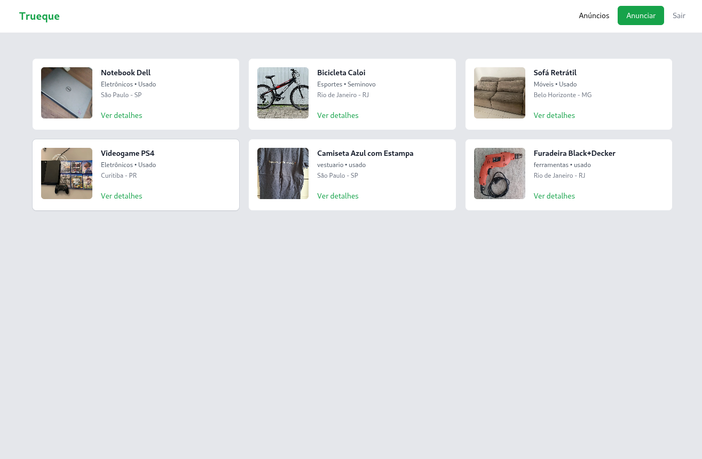
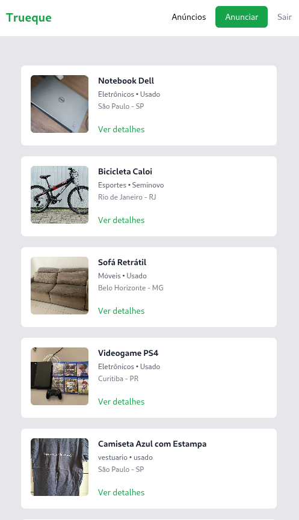
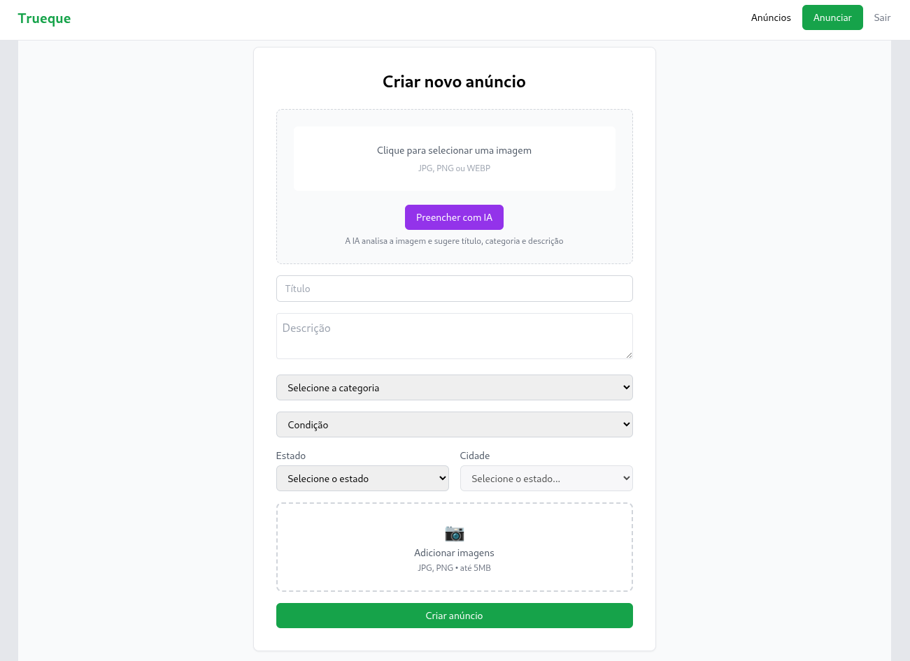
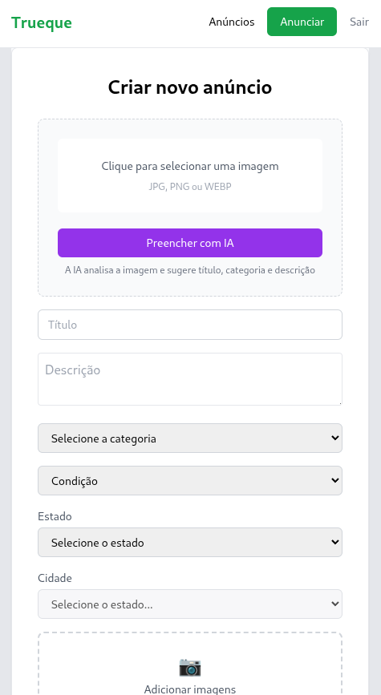

# Trueque Marketplace – Frontend

**Trueque Marketplace** é uma plataforma de trocas de itens em que **não há envolvimento de dinheiro**. Seu objetivo é **promover a sustentabilidade**, a **reutilização consciente de bens** e estimular uma **economia colaborativa e ecológica**.

A ideia central é **evitar o desperdício**, **prolongar a vida útil dos objetos** e **incentivar conexões sociais significativas** por meio da troca. Qualquer item pode ser oferecido ou solicitado, valorizando o que já existe e reduzindo a necessidade de consumo excessivo.
---

## Telas da Aplicação

### Home (Desktop)


### Home (Mobile)


### Criar Anúncio


### Criar Anúncio (Mobile)



## Funcionalidades

- Autenticação de usuários (login e cadastro)
- Criação de anúncios de marketplace
- Upload de imagens com preview
- Preenchimento automático de anúncio com IA (título, categoria e descrição)
- Interface responsiva (desktop e mobile)
- Integração completa com API backend

---

## IA aplicada

A funcionalidade de **Preenchimento com IA** permite que o usuário envie uma imagem do produto e receba automaticamente:

- Título sugerido
- Categoria
- Descrição do produto

Essa comunicação é feita via API, que processa a imagem e retorna os dados estruturados.

---

## Tecnologias utilizadas

### Frontend

- **React**
- **TypeScript**
- **Vite**
- **Tailwind CSS**
- **Axios**

### Boas práticas

- Componentização reutilizável
- Design system simples (Button, Upload, etc.)
- Estados de loading e feedback visual
- Código limpo e modular

---

## Backend (API)

O backend da aplicação está disponível em:

 **[https://github.com/welitonlimaa/trueque-api]**

Ele é responsável por:
- Autenticação com JWT
- Processamento de imagens
- Integração com IA
- Persistência de dados

---

## Como executar o projeto

### Pré-requisitos

- Node.js >= 18
- npm ou yarn

### Passos

```bash
# instalar dependências
npm install

# executar em modo desenvolvimento
npm run dev
```

Para acessar pelo celular (rede local):

```bash
npm run dev -- --host
```

---

## Variáveis de ambiente

Crie um arquivo `.env` na raiz do projeto:

```env
VITE_API_URL=http://IP_DA_SUA_MAQUINA:8080
```

---

## Responsividade

O projeto foi pensado para funcionar bem em:

- Desktop
- Tablets
- Smartphones

Utilizando breakpoints do Tailwind CSS.

---

## Status do projeto

🚧 Em desenvolvimento ativo

Novas funcionalidades e melhorias de UX/UI estão em constante evolução.

---
